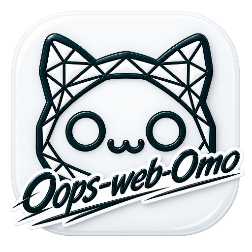

<div align="center">

# omo-webchat

**[oh-my-openagent (omo)](https://github.com/code-yeongyu/oh-my-openagent)의 네이티브 팬메이드 앱입니다.**
**원본 omo에게 무한한 감사와 영광, 그리고 존경을 표합니다.** 🙏



앱 아이콘은 [@sanguneo](https://github.com/sanguneo)님이 만들어주셨습니다. 감사합니다! 🎨

로컬에서 omo CLI와 대화하는 웹 UI · A local web UI for the omo CLI

[github.com/DevNewbie1826/omo-webchat](https://github.com/DevNewbie1826/omo-webchat)

</div>

---

## 한국어

`omo-webchat`은 Go 바이너리 하나로 동작하는 로컬 웹 채팅 UI입니다. 임베드된 React SPA를 서빙하고, 모든 채팅을 공유 omo 프로세스(`omo --mode rpc --multi-session`) 위의 논리 세션으로 실행합니다.

### 요구 사항

- 채팅을 만들려면 `PATH`에 `omo`가 있어야 합니다.
- macOS·Linux (amd64/arm64), Windows (amd64, zip 릴리스).
- Windows 주의: 서버 자체는 Windows에서 빌드되고 부팅되며 Windows CI를 통과하고, 이미 실행 중인 omo RPC 데몬에 연결됩니다. 다만 Windows에서 omo RPC 데몬을 직접 실행하는 것은 현재 업스트림 CLI 이슈(code-yeongyu/senpi#1370)로 막혀 있습니다.

### 설치 (macOS · Linux)

```sh
curl -fsSL https://raw.githubusercontent.com/DevNewbie1826/omo-webchat/main/install.sh | sh
```

특정 버전·경로를 지정하려면:

```sh
curl -fsSL https://raw.githubusercontent.com/DevNewbie1826/omo-webchat/main/install.sh | VERSION=vX.Y.Z INSTALL_DIR=~/.local/bin sh
```

### 설치 (Windows)

PowerShell 5.1 이상에서 실행하세요. 관리자 권한은 필요 없습니다.

```powershell
irm https://raw.githubusercontent.com/DevNewbie1826/omo-webchat/main/install.ps1 | iex
```

릴리스 zip(`omo-webchat_windows_amd64.zip`)을 내려받아 `checksums.txt`의 SHA-256과 대조한 뒤 `%LOCALAPPDATA%\Programs\omo-webchat`에 설치하고, 그 경로를 사용자 PATH에 추가합니다(새 터미널부터 적용).

특정 버전·경로를 지정하거나 PATH를 건드리지 않으려면 인자를 넘기세요:

```powershell
& ([scriptblock]::Create((irm https://raw.githubusercontent.com/DevNewbie1826/omo-webchat/main/install.ps1))) -Version vX.Y.Z -InstallDir C:\tools\omo-webchat -NoPathUpdate
```

지원 대상은 Windows x64입니다. arm64 릴리스는 아직 없으니 소스에서 빌드하세요.

### npx / bunx

npx 경로의 전제 조건은 Node뿐입니다. 채팅을 만들려면 런타임에 `PATH`의 `omo`가 여전히 필요합니다 (`CHAT_PI_BINARY`로 재정의).

```sh
npx omo-webchat@latest --password <secret> --port <port> --root <root>
```

```sh
bunx omo-webchat@latest --password <secret> --port <port> --root <root>
```

### 빠른 시작

```sh
omo-webchat --password <secret>
```

브라우저에서 `http://127.0.0.1:8080`을 열고 비밀번호로 로그인하세요.

백그라운드 실행(darwin/linux):

```sh
omo-webchat --password <secret> --daemon   # 시작
omo-webchat --status                       # 상태
omo-webchat --stop                         # 중지
```

### 주요 기능

- 비밀번호 로그인 뒤의 채팅 SPA, WebSocket 스트리밍, GFM 마크다운
- 워크스페이스별 채팅 관리, 파일 브라우저(업로드·편집·다운로드), `@` 파일 멘션
- `/` 슬래시 명령, `$` 스킬 팔레트, 모델 선택, 이미지 첨부
- 가로/세로 분할 뷰, 한국어/English, 폰트·글자 크기 설정, 모바일 대응

### 주요 플래그

| 플래그 | 환경 변수 | 기본값 | 역할 |
|---|---|---|---|
| `--host` | `TH_HOST` | `127.0.0.1` | 리슨 주소 |
| `--port` | `TH_PORT` | `8080` | 리슨 포트 |
| `--password` | `TH_PASSWORD` | — | 접속 비밀번호 (서빙 시 필수) |
| `--root` | `TH_ROOT` | 홈 디렉터리 | 파일 브라우저·워크스페이스 루트 |
| `--state-dir` | `TH_STATE_DIR` | `$XDG_STATE_HOME/omo-webchat` 또는 `~/.local/state/omo-webchat` | 상태 디렉터리 |

플래그가 환경 변수보다 항상 우선합니다.

### 소스 빌드

```sh
make build   # 프론트엔드(npm ci + vite build) 후 go build → bin/omo-webchat
```

Go 1.26, Node 22가 필요합니다. 로컬 실행은 `make run` (개발용 비밀번호 `dev123`).

### 보안

기본 바인드는 루프백(`127.0.0.1`)이고 프로세스 안에 TLS는 없습니다. 비루프백에 바인드할 때는 TLS 역프록시 뒤에 두세요. 세션 토큰은 메모리에만 있어 재시작하면 다시 로그인합니다.

### 테스트

```sh
go test ./...
cd frontend && npx vitest run
sh test/install_checksum_test.sh
pwsh -NoProfile -File test/install_ps1_test.ps1   # Windows installer
```

---

## English

`omo-webchat` is a single Go binary that serves an embedded React SPA and runs every chat as a logical session on one shared omo process (`omo --mode rpc --multi-session`).

### Requirements

- `omo` on `PATH` to create chats.
- macOS / Linux (amd64, arm64), Windows (amd64, zip release).
- Windows caveat: the server itself builds, boots, and passes its Windows CI, and connects to an already-running omo RPC daemon. Running the real omo RPC daemon on Windows is currently blocked by an upstream CLI issue (code-yeongyu/senpi#1370).

### Install (macOS / Linux)

```sh
curl -fsSL https://raw.githubusercontent.com/DevNewbie1826/omo-webchat/main/install.sh | sh
```

Pin a version or install path:

```sh
curl -fsSL https://raw.githubusercontent.com/DevNewbie1826/omo-webchat/main/install.sh | VERSION=vX.Y.Z INSTALL_DIR=~/.local/bin sh
```

### Install (Windows)

Run in PowerShell 5.1 or newer; no administrator rights required.

```powershell
irm https://raw.githubusercontent.com/DevNewbie1826/omo-webchat/main/install.ps1 | iex
```

It downloads the release zip (`omo-webchat_windows_amd64.zip`), verifies its SHA-256 against `checksums.txt`, installs into `%LOCALAPPDATA%\Programs\omo-webchat`, and adds that directory to your user PATH (effective in new terminals).

Pass arguments to pin a version, choose a directory, or leave PATH alone:

```powershell
& ([scriptblock]::Create((irm https://raw.githubusercontent.com/DevNewbie1826/omo-webchat/main/install.ps1))) -Version vX.Y.Z -InstallDir C:\tools\omo-webchat -NoPathUpdate
```

Windows x64 only; there is no arm64 release yet, so build from source on arm64.

### npx / bunx

Node is the only prerequisite for the npx path. `omo` on `PATH` is still needed at runtime to create chats (set `CHAT_PI_BINARY` to override).

```sh
npx omo-webchat@latest --password <secret> --port <port> --root <root>
```

```sh
bunx omo-webchat@latest --password <secret> --port <port> --root <root>
```

### Quick start

```sh
omo-webchat --password <secret>
```

Open `http://127.0.0.1:8080` and log in with your password.

Background daemon (darwin/linux):

```sh
omo-webchat --password <secret> --daemon   # start
omo-webchat --status                       # status
omo-webchat --stop                         # stop
```

### Features

- Password-gated chat SPA, WebSocket streaming, GFM markdown
- Workspaces, file browser (upload / edit / download), `@` file mentions
- `/` slash commands, `$` skill palette, model picker, image attachments
- Horizontal/vertical split panes, Korean/English UI, font settings, mobile support

### Flags

| Flag | Env | Default | Purpose |
|---|---|---|---|
| `--host` | `TH_HOST` | `127.0.0.1` | Listen address |
| `--port` | `TH_PORT` | `8080` | Listen port |
| `--password` | `TH_PASSWORD` | — | Access password (required when serving) |
| `--root` | `TH_ROOT` | home directory | File browser / workspace root |
| `--state-dir` | `TH_STATE_DIR` | `$XDG_STATE_HOME/omo-webchat` or `~/.local/state/omo-webchat` | State directory |

CLI flags always win over environment variables.

### Build from source

```sh
make build   # frontend (npm ci + vite build), then go build → bin/omo-webchat
```

Requires Go 1.26 and Node 22. For local runs: `make run` (dev password `dev123`).

### Security

Binds to loopback (`127.0.0.1`) by default and has no in-process TLS — put a TLS reverse proxy in front when binding off loopback. Session tokens are memory-only, so a restart requires a new login.

### Tests

```sh
go test ./...
cd frontend && npx vitest run
sh test/install_checksum_test.sh
pwsh -NoProfile -File test/install_ps1_test.ps1   # Windows installer
```
