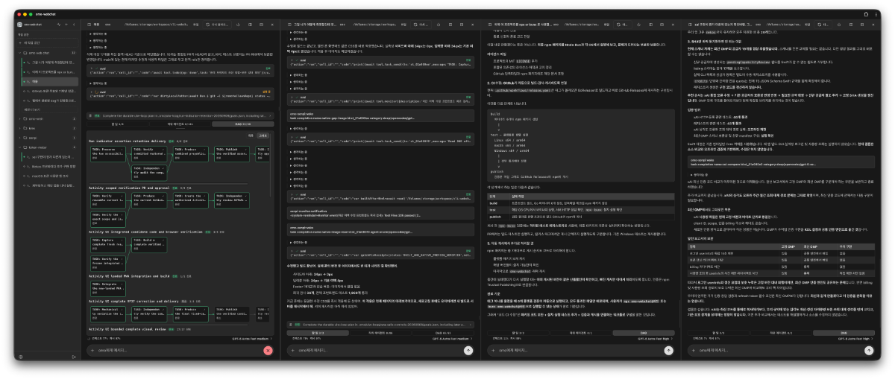
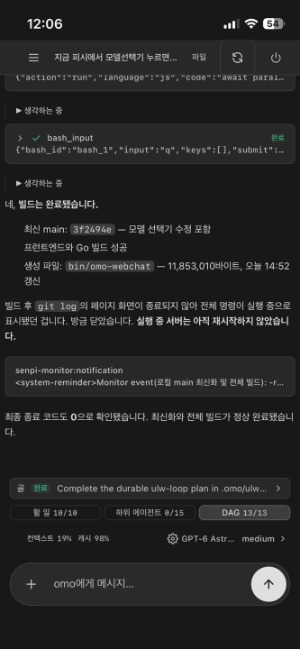

<div align="center">

# omo-webchat

**[oh-my-openagent (omo)](https://github.com/code-yeongyu/oh-my-openagent)의 네이티브 팬메이드 앱입니다.**
**원본 omo에게 무한한 감사와 영광, 그리고 존경을 표합니다.** 🙏


앱 아이콘은 [@sanguneo](https://github.com/sanguneo)님이 만들어주셨습니다. 감사합니다! 🎨

로컬에서 omo CLI와 대화하는 웹 UI · A local web UI for the omo CLI

[github.com/DevNewbie1826/omo-webchat](https://github.com/DevNewbie1826/omo-webchat)

</div>

## 실행 화면 · Screenshots

### 데스크톱 · Desktop

<p align="center">
  <a href="docs/images/pc.png">
    
  </a>
</p>

### 모바일 · Mobile

<p align="center">
  <a href="docs/images/mo.jpeg">
    
  </a>
</p>

<p align="center">
  <sub>이미지를 클릭하면 원본 크기로 볼 수 있습니다. · Click an image to view it at full size.</sub>
</p>

---

## 한국어

`omo-webchat`은 Go 바이너리 하나로 동작하는 로컬 웹 채팅 UI입니다. 임베드된 React SPA를 서빙하고, 모든 채팅을 공유 omo 프로세스(`omo --mode rpc --multi-session`) 위의 논리 세션으로 실행합니다.

### 요구 사항

- 채팅을 만들려면 `PATH`에 `omo`가 있어야 합니다.
- macOS·Linux (amd64/arm64), Windows (amd64/arm64, zip 릴리스).
- Windows RPC는 인증된 named pipe를 사용합니다. CI 런타임은 `omo-ai@5.0.0-0.beta.43` (senpi `2026.9.5`), Bun `1.3.10`, Node `24.15.0`으로 고정되어 있습니다. Bun의 `omo.exe` 또는 npm이 생성한 `omo.cmd`를 PATH에 두세요. npm 설치는 Node로 실제 `omo.js`를 실행하며, `CHAT_PI_BINARY`에 해당 `.js`의 절대 경로를 직접 지정할 수도 있습니다. 서버는 필요한 데몬을 시작하거나 호환 데몬을 재사용하며, 자신이 시작한 프로세스 트리만 종료합니다. 잘못된 크기·소유권·권한의 `.secret` 파일이나 reparse 경로는 자동 덮어쓰기 없이 거부합니다.

### 설치 (macOS · Linux)

```sh
curl -fsSL https://raw.githubusercontent.com/DevNewbie1826/omo-webchat/main/install.sh | sh
```

특정 버전·경로를 지정하려면:

```sh
curl -fsSL https://raw.githubusercontent.com/DevNewbie1826/omo-webchat/main/install.sh | VERSION=vX.Y.Z INSTALL_DIR=~/.local/bin sh
```

### 설치 (Windows)

PowerShell 5.1 이상에서 실행하세요. 관리자 권한은 필요 없습니다.

```powershell
irm https://raw.githubusercontent.com/DevNewbie1826/omo-webchat/main/install.ps1 | iex
```

릴리스 zip(`omo-webchat_windows_amd64.zip`)을 내려받아 `checksums.txt`의 SHA-256과 대조한 뒤 `%LOCALAPPDATA%\Programs\omo-webchat`에 설치하고, 그 경로를 사용자 PATH에 추가합니다(새 터미널부터 적용).

특정 버전·경로를 지정하거나 PATH를 건드리지 않으려면 인자를 넘기세요:

```powershell
& ([scriptblock]::Create((irm https://raw.githubusercontent.com/DevNewbie1826/omo-webchat/main/install.ps1))) -Version vX.Y.Z -InstallDir C:\tools\omo-webchat -NoPathUpdate
```

Windows x64·arm64를 모두 지원하며, 호스트 아키텍처에 맞는 자산을 자동으로 받습니다.

### npx / bunx

npm 패키지는 래퍼(`omo-webchat`) 하나와 여섯 개의 플랫폼 바이너리 패키지(`omo-webchat-<os>-<arch>`)로 구성됩니다. `optionalDependencies`가 현재 플랫폼에 맞는 하나만 같은 버전으로 설치합니다.

- npx에는 Node 18 이상이 필요합니다(래퍼의 `engines` 조건). Bun 사용자는 `bunx` 또는 `bunx --bun`을 쓸 수 있습니다. 단, 테스트한 호스티드 Windows 환경(Bun 1.4.2)에서 `bunx --bun`은 설치 후 래퍼를 실행하지 않고 종료되는 것이 관찰됐습니다. 해당 환경에서는 `npx` 또는 일반 `bunx`를 권장합니다.
- 채팅을 만들려면 런타임에 공식 `omo` CLI가 필요합니다. 기본적으로 `PATH`에서 `omo`를 찾습니다. `PATH`에 다른 `omo`가 있거나 충돌이 있으면 `CHAT_PI_BINARY`에 원하는 바이너리의 절대 경로를 명시하세요. 이 변수가 항상 최우선입니다.

```sh
npx omo-webchat@latest --password <secret> --port <port> --root <root>
```

```sh
bunx omo-webchat@latest --password <secret> --port <port> --root <root>
```

안정 버전은 `latest` 태그, 프리릴리스(예: `0.1.0-rc.1`)는 `next` 태그로 배포됩니다. 릴리스 파이프라인과 게시 절차는 [docs/releasing.md](docs/releasing.md)를 참고하세요.

> 릴리스 상태: 게시 여부는 시점에 따라 달라집니다. 설치하려는 버전이 공개되어 있는지 npm 패키지 페이지와 GitHub Releases에서 확인하세요. 게시 절차와 첫 공개 부트스트랩은 [docs/releasing.md](docs/releasing.md)에 정의되어 있습니다.

### 빠른 시작

```sh
omo-webchat --password <secret>
```

브라우저에서 `http://127.0.0.1:8080`을 열고 비밀번호로 로그인하세요.

백그라운드 실행(darwin/linux):

```sh
omo-webchat --password <secret> --daemon   # 시작
omo-webchat --status                       # 상태
omo-webchat --stop                         # 중지
```

### 주요 기능

- 비밀번호 로그인 뒤의 채팅 SPA, WebSocket 스트리밍, GFM 마크다운
- 워크스페이스별 채팅 관리, 파일 브라우저(업로드·편집·다운로드), `@` 파일 멘션
- `/` 슬래시 명령, `$` 스킬 팔레트, 모델 선택, 이미지 첨부
- 가로/세로 분할 뷰, 한국어/English, 폰트·글자 크기 설정, 모바일 대응

### omo와 senpi 함께 업데이트하기

채팅에서 `/update`를 선택하거나 입력한 뒤 전송하고 **함께 업데이트**를 누르세요.
서버가 현재 사용하는 omo 설치의 패키지 매니저로 `omo-ai@beta`와 그 버전에
고정된 senpi 엔진을 함께 설치합니다. 별도로 설치된 전역 senpi나 omo-webchat
자체를 업데이트하는 기능은 아닙니다. 제공자가 자체 `/update` 명령을 등록했다면
그 명령이 우선합니다.

로그인한 사용자만 실행할 수 있고, 동시에 들어온 업데이트 요청은 거부합니다.
설치 실패는 대화상자에 표시하며 자동으로 재시도하지 않습니다. 창을 닫아도
설치는 계속되고, 같은 채팅에서 `/update`를 다시 보내면 결과를 확인할 수 있습니다.
인식할 수 없는 사용자 정의 설치는 다른 설치를 대신 갱신하지 않고 오류를 반환합니다.

macOS·Linux의 npm 전역 prefix와 Bun 전역 설치를 지원합니다. Windows는 실행 중인
네이티브 모듈의 파일 잠금으로 설치가 손상될 수 있어 웹 업데이트를 거부합니다.
Windows에서는 모든 omo/senpi 프로세스와 웹챗을 종료한 뒤 터미널에서 설치에 사용한
패키지 매니저로 업데이트하세요.

설치 완료가 실행 중인 엔진의 교체를 뜻하지는 않습니다. 설치가 끝나면 같은
대화상자의 **지금 적용**을 누르세요. 웹챗을 떠나지 않고 엔진만 새 프로세스로
교체해 새 버전을 활성화합니다. 나중에 적용하려면 설정 메뉴의 **omo 엔진 다시
시작**을 눌러도 같은 동작이 실행됩니다. 기존 세션을 강제로 재시작하지 않습니다.

### omo 엔진 다시 시작하기

설정 메뉴의 **omo 엔진 다시 시작**을 누르면 서버가 실행 중인 omo 엔진
프로세스만 새 프로세스로 교체합니다. omo-webchat 자체는 웹 UI에서 재시작되지
않고 로그인 상태도 유지됩니다.

열린 채팅은 새 엔진 연결에서 자동으로 다시 열리지만, 교체 순간 스트리밍 중이던
답변은 중단됩니다. 실행 중인 채팅이 있으면 확인 창이 미리 경고합니다.
로그인한 사용자만 실행할 수 있고, 설치 업데이트와 엔진 재시작은 동시에
실행되지 않습니다. 한쪽이 진행 중이면 다른 요청은 거부합니다.

이 서버가 시작한 엔진만 재시작할 수 있습니다. 다른 프로세스가 시작한 엔진에
연결된 경우에는 소유하지 않은 프로세스를 안전하게 종료할 방법이 없어 요청을
거부합니다. 업데이트 없이도, 엔진을 오래 켜 둔 뒤 새로 시작하고 싶을 때
단독으로 사용할 수 있습니다.

### 주요 플래그

| 플래그 | 환경 변수 | 기본값 | 역할 |
|---|---|---|---|
| `--host` | `TH_HOST` | `127.0.0.1` | 리슨 주소 |
| `--port` | `TH_PORT` | `8080` | 리슨 포트 |
| `--password` | `TH_PASSWORD` | — | 접속 비밀번호 (서빙 시 필수) |
| `--root` | `TH_ROOT` | 홈 디렉터리 | 파일 브라우저·워크스페이스 루트 |
| `--state-dir` | `TH_STATE_DIR` | `$XDG_STATE_HOME/omo-webchat` 또는 `~/.local/state/omo-webchat` | 상태 디렉터리 |

플래그가 환경 변수보다 항상 우선합니다.

### 소스 빌드

```sh
make build   # 프론트엔드(npm ci + vite build) 후 go build → bin/omo-webchat
```

Go 1.26, Node 22가 필요합니다. 로컬 실행은 `make run` (개발용 비밀번호 `dev123`).

### 보안

기본 바인드는 루프백(`127.0.0.1`)이고 프로세스 안에 TLS는 없습니다. 비루프백에 바인드할 때는 TLS 역프록시 뒤에 두세요. 세션 토큰은 메모리에만 있어 재시작하면 다시 로그인합니다.

### 테스트

```sh
go test ./...
cd frontend && npx vitest run
sh test/install_checksum_test.sh
pwsh -NoProfile -File test/install_ps1_test.ps1   # Windows installer
```

---

## English

`omo-webchat` is a single Go binary that serves an embedded React SPA and runs every chat as a logical session on one shared omo process (`omo --mode rpc --multi-session`).

### Requirements

- `omo` on `PATH` to create chats.
- macOS / Linux (amd64, arm64), Windows (amd64, arm64, zip release).
- Windows RPC uses authenticated named pipes. CI pins `omo-ai@5.0.0-0.beta.43` (senpi `2026.9.5`), Bun `1.3.10`, and Node `24.15.0`. Put Bun's `omo.exe` or npm's `omo.cmd` on PATH. npm installs run the actual `omo.js` through Node; `CHAT_PI_BINARY` can also name the absolute `.js` entry path. The server starts a missing daemon or reuses a compatible one, and only terminates process trees it owns. Malformed, untrusted, or reparse-backed `.secret` files are rejected rather than overwritten; valid secrets are retained across shutdown and re-read on reconnect.

### Install (macOS / Linux)

```sh
curl -fsSL https://raw.githubusercontent.com/DevNewbie1826/omo-webchat/main/install.sh | sh
```

Pin a version or install path:

```sh
curl -fsSL https://raw.githubusercontent.com/DevNewbie1826/omo-webchat/main/install.sh | VERSION=vX.Y.Z INSTALL_DIR=~/.local/bin sh
```

### Install (Windows)

Run in PowerShell 5.1 or newer; no administrator rights required.

```powershell
irm https://raw.githubusercontent.com/DevNewbie1826/omo-webchat/main/install.ps1 | iex
```

It downloads the release zip (`omo-webchat_windows_amd64.zip`), verifies its SHA-256 against `checksums.txt`, installs into `%LOCALAPPDATA%\Programs\omo-webchat`, and adds that directory to your user PATH (effective in new terminals).

Pass arguments to pin a version, choose a directory, or leave PATH alone:

```powershell
& ([scriptblock]::Create((irm https://raw.githubusercontent.com/DevNewbie1826/omo-webchat/main/install.ps1))) -Version vX.Y.Z -InstallDir C:\tools\omo-webchat -NoPathUpdate
```

Both Windows x64 and arm64 are supported; the matching asset is picked from your host architecture.

### npx / bunx

The npm distribution is one wrapper package (`omo-webchat`) plus six platform binary packages (`omo-webchat-<os>-<arch>`). `optionalDependencies` installs exactly the one matching your platform, at the same version as the wrapper.

- npx needs Node 18 or newer (the wrapper's `engines` range). Bun users can run `bunx` or `bunx --bun`. Note: `bunx --bun` was observed on the tested hosted Windows setup with Bun 1.4.2 to exit after installation without running the wrapper; prefer `npx` or plain `bunx` there.
- The official `omo` CLI is still required at runtime to answer chats. By default the shim looks for `omo` on `PATH`. If a different `omo` is on your `PATH`, or you want a specific build, set `CHAT_PI_BINARY` to the absolute path of the agent binary. That variable always wins.

```sh
npx omo-webchat@latest --password <secret> --port <port> --root <root>
```

```sh
bunx omo-webchat@latest --password <secret> --port <port> --root <root>
```

Stable versions publish under the `latest` tag; prereleases (for example `0.1.0-rc.1`) publish under `next`. See [docs/releasing.md](docs/releasing.md) for the release pipeline and publication procedure.

> Release status: publication state changes over time. Check the npm package page and GitHub Releases to confirm the version you want is public before installing. The publication procedure and first-time bootstrap are defined in [docs/releasing.md](docs/releasing.md).

### Quick start

```sh
omo-webchat --password <secret>
```

Open `http://127.0.0.1:8080` and log in with your password.

Background daemon (darwin/linux):

```sh
omo-webchat --password <secret> --daemon   # start
omo-webchat --status                       # status
omo-webchat --stop                         # stop
```

### Features

- Password-gated chat SPA, WebSocket streaming, GFM markdown
- Workspaces, file browser (upload / edit / download), `@` file mentions
- `/` slash commands, `$` skill palette, model picker, image attachments
- Horizontal/vertical split panes, Korean/English UI, font settings, mobile support

### Update omo and senpi together

Select or type `/update`, submit it, then choose **Update both**. The server
updates its configured omo installation to `omo-ai@beta` using that installation's
package manager, including the matching pinned senpi engine. It does not update
a separately installed global senpi or omo-webchat itself. A provider-advertised
`/update` command retains precedence.

The action requires login and rejects concurrent update requests. Installation
failures remain visible without automatic retries. Closing the dialog does not
cancel installation; submit `/update` again in the same chat to see its result.
Unrecognized custom installations fail instead of updating a different installation.

Global npm-prefix and Bun installations are supported on macOS and Linux.
Windows in-place updates are rejected because loaded native-module locks can
leave a partial installation. On Windows, stop every omo/senpi process and
webchat first, then update with the installation's package manager in a terminal.

Installation does not replace the running engine. When the install finishes,
choose **Apply now** in the same dialog: it replaces just the engine process with
a fresh one and activates the new version without leaving omo-webchat. To apply
it later instead, **Restart omo engine** in the settings menu does the same
thing. Existing sessions are never forcibly restarted by this action.

### Restart the omo engine

Choose **Restart omo engine** in the settings menu, and the server replaces only
the running omo engine process with a fresh one. omo-webchat itself is never
restarted from the web UI, and you stay signed in.

Open chats reopen automatically on the new engine connection, but an answer that
is streaming at that moment is interrupted. The confirmation dialog warns when
chats are running. The action requires login, and installation updates and engine
restarts never run at the same time; a second request while one runs is refused.

Only an engine started by this server can be restarted. When the server attached
to an engine someone else started, the request is refused because there is no safe
way to stop a process this server does not own. A restart is also useful on its
own, without an update, when the engine has been running for a long time.

### Flags

| Flag | Env | Default | Purpose |
|---|---|---|---|
| `--host` | `TH_HOST` | `127.0.0.1` | Listen address |
| `--port` | `TH_PORT` | `8080` | Listen port |
| `--password` | `TH_PASSWORD` | — | Access password (required when serving) |
| `--root` | `TH_ROOT` | home directory | File browser / workspace root |
| `--state-dir` | `TH_STATE_DIR` | `$XDG_STATE_HOME/omo-webchat` or `~/.local/state/omo-webchat` | State directory |

CLI flags always win over environment variables.

### Build from source

```sh
make build   # frontend (npm ci + vite build), then go build → bin/omo-webchat
```

Requires Go 1.26 and Node 22. For local runs: `make run` (dev password `dev123`).

### Security

Binds to loopback (`127.0.0.1`) by default and has no in-process TLS — put a TLS reverse proxy in front when binding off loopback. Session tokens are memory-only, so a restart requires a new login.

### Tests

```sh
go test ./...
cd frontend && npx vitest run
sh test/install_checksum_test.sh
pwsh -NoProfile -File test/install_ps1_test.ps1   # Windows installer
```
