<div align="center">

# omo-webchat

**[oh-my-openagent (omo)](https://github.com/code-yeongyu/oh-my-openagent)의 네이티브 팬메이드 앱입니다.**
**원본 omo에게 무한한 감사와 영광, 그리고 존경을 표합니다.** 🙏

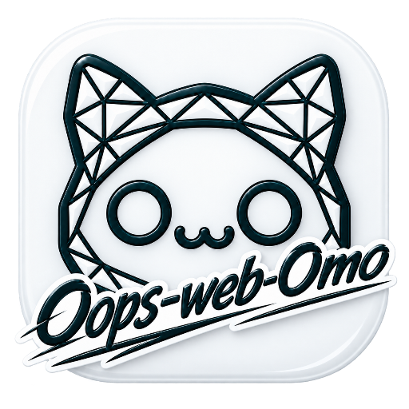

앱 아이콘은 [@sanguneo](https://github.com/sanguneo)님이 만들어주셨습니다. 감사합니다! 🎨

로컬에서 omo CLI와 대화하는 웹 UI · A local web UI for the omo CLI

[github.com/DevNewbie1826/omo-webchat](https://github.com/DevNewbie1826/omo-webchat)

</div>

## 실행 화면 · Screenshots

<p align="center">
  <picture>
    <source media="(prefers-color-scheme: dark)" srcset="docs/images/readme/hero-desktop-dark.webp" />
    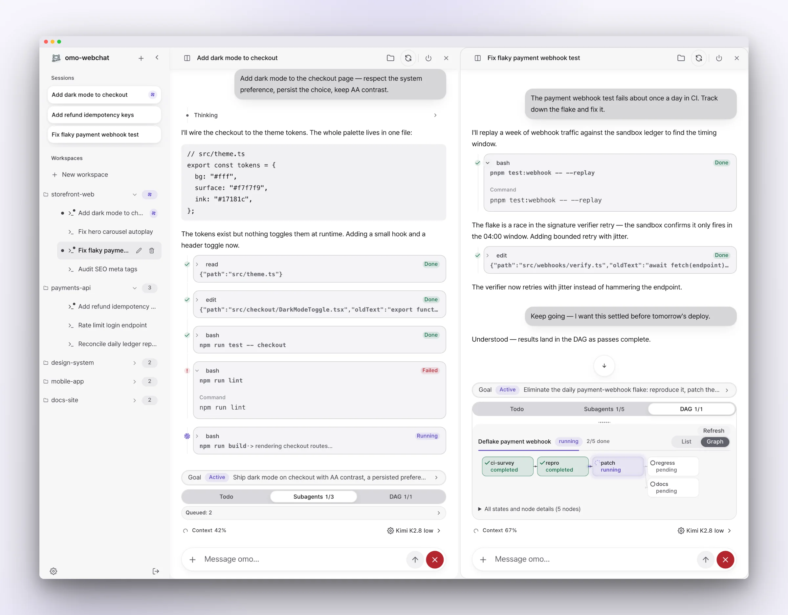
  </picture>
</p>

### 모바일 · Mobile

<p align="center">
  <picture>
    <source media="(prefers-color-scheme: dark)" srcset="docs/images/readme/mobile-dark.webp" />
    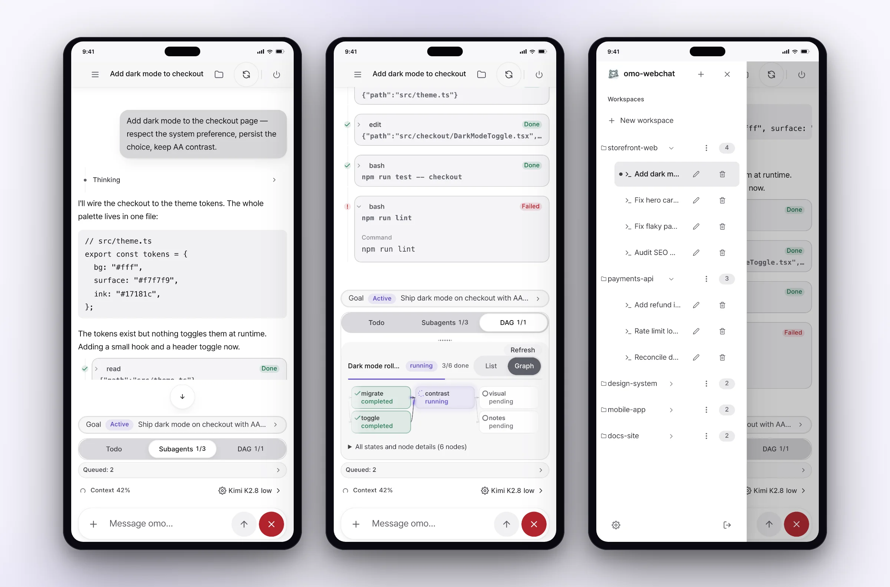
  </picture>
</p>

### 주요 기능 · Features

<table>
  <tr>
    <td width="50%" valign="top">
  <picture>
    <source media="(prefers-color-scheme: dark)" srcset="docs/images/readme/dag-dark.webp" />
    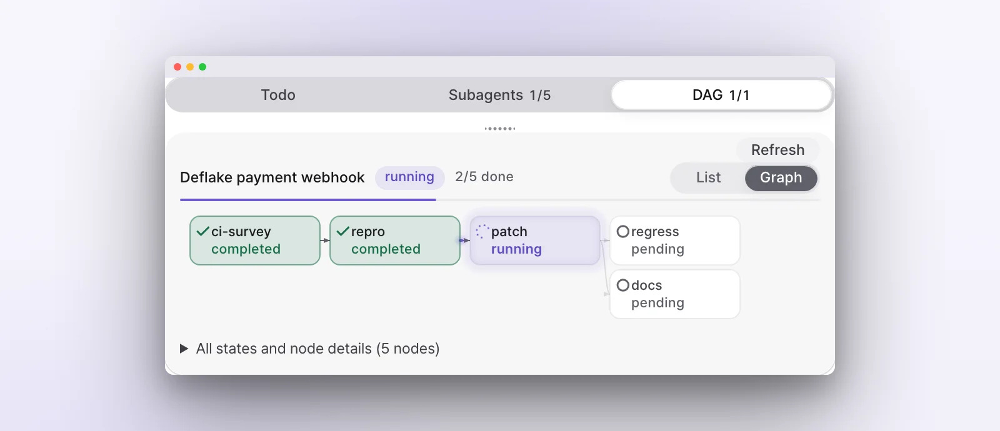
  </picture>
  <br /><b>DAG 그래프 · DAG graph</b><br /><sub>여러 에이전트 작업 흐름을 실시간 그래프로 · Multi-agent runs as a live graph</sub>
    </td>
    <td width="50%" valign="top">
  <picture>
    <source media="(prefers-color-scheme: dark)" srcset="docs/images/readme/agents-dark.webp" />
    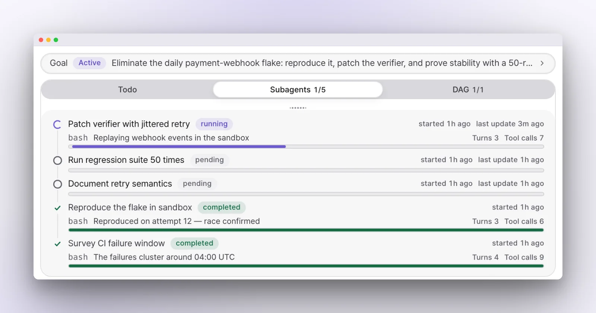
  </picture>
  <br /><b>하위 에이전트 · Subagents</b><br /><sub>골 진행 상태와 하위 에이전트 목록 · Goal progress and the subagent roster</sub>
    </td>
  </tr>
  <tr>
    <td width="50%" valign="top">
  <picture>
    <source media="(prefers-color-scheme: dark)" srcset="docs/images/readme/tools-dark.webp" />
    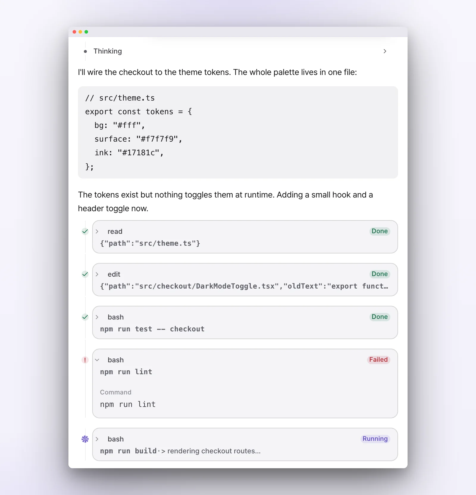
  </picture>
  <br /><b>도구 카드 · Tool cards</b><br /><sub>실행 중·완료·실패가 한눈에 · Running, done and failed at a glance</sub>
    </td>
    <td width="50%" valign="top">
  <picture>
    <source media="(prefers-color-scheme: dark)" srcset="docs/images/readme/split-dark.webp" />
    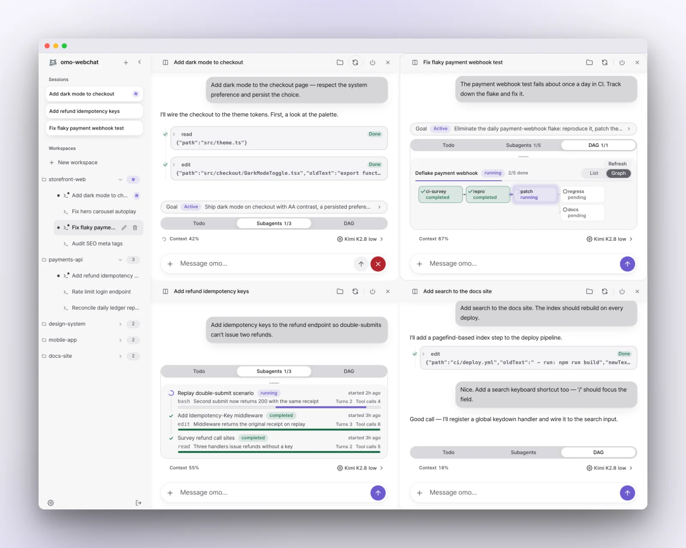
  </picture>
  <br /><b>분할 뷰 · Split panes</b><br /><sub>여러 세션을 나란히 · Several sessions side by side</sub>
    </td>
  </tr>
  <tr>
    <td width="50%" valign="top">
  <picture>
    <source media="(prefers-color-scheme: dark)" srcset="docs/images/readme/files-tree-dark.webp" />
    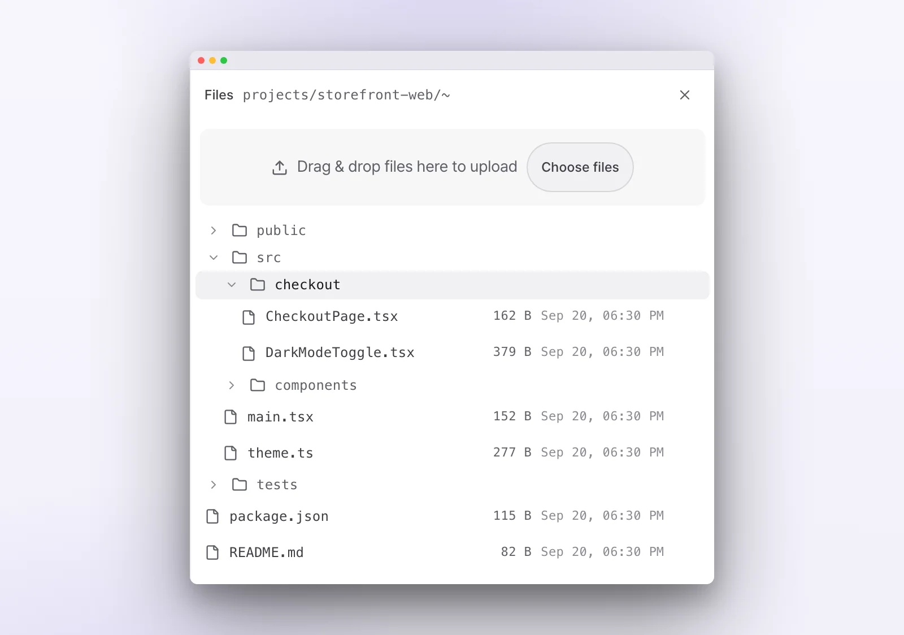
  </picture>
  <br /><b>파일 브라우저 · File browser</b><br /><sub>업로드·폴더 탐색 · Upload and browse folders</sub>
    </td>
    <td width="50%" valign="top">
  <picture>
    <source media="(prefers-color-scheme: dark)" srcset="docs/images/readme/files-editor-dark.webp" />
    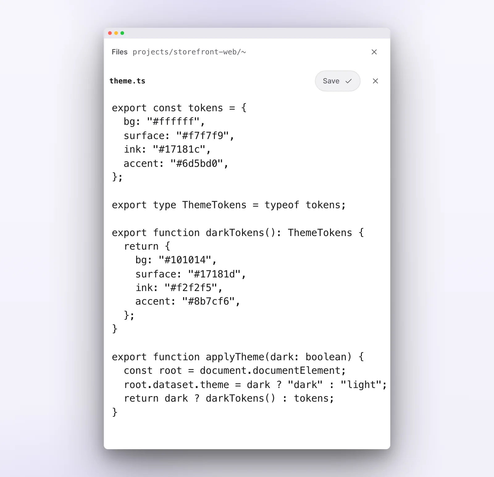
  </picture>
  <br /><b>파일 편집 · File editor</b><br /><sub>브라우저에서 바로 편집·저장 · Edit and save in the browser</sub>
    </td>
  </tr>
  <tr>
    <td width="50%" valign="top">
  <picture>
    <source media="(prefers-color-scheme: dark)" srcset="docs/images/readme/composer-dark.webp" />
    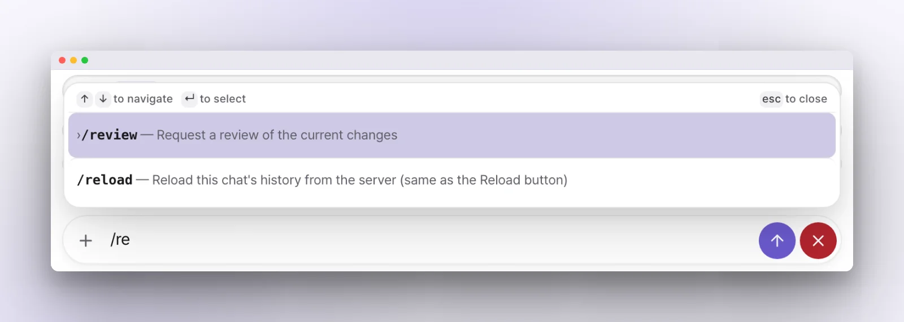
  </picture>
  <br /><b>슬래시 명령 · Slash commands</b><br /><sub>`/`로 명령 검색 · Search commands with `/`</sub>
    </td>
    <td width="50%" valign="top">
  <picture>
    <source media="(prefers-color-scheme: dark)" srcset="docs/images/readme/skills-dark.webp" />
    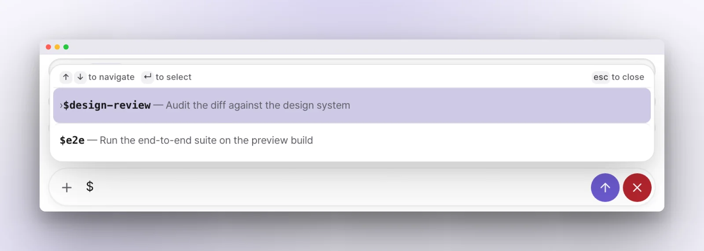
  </picture>
  <br /><b>스킬 팔레트 · Skill palette</b><br /><sub>`$`로 스킬 실행 · Run skills with `$`</sub>
    </td>
  </tr>
  <tr>
    <td width="50%" valign="top">
  <picture>
    <source media="(prefers-color-scheme: dark)" srcset="docs/images/readme/models-dark.webp" />
    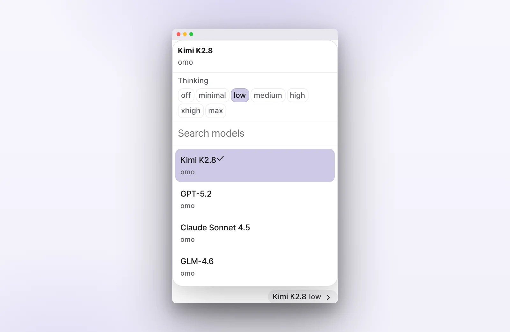
  </picture>
  <br /><b>모델 선택 · Model picker</b><br /><sub>모델과 생각 수준 선택 · Pick a model and thinking level</sub>
    </td>
    <td width="50%" valign="top">
  <picture>
    <source media="(prefers-color-scheme: dark)" srcset="docs/images/readme/settings-dark.webp" />
    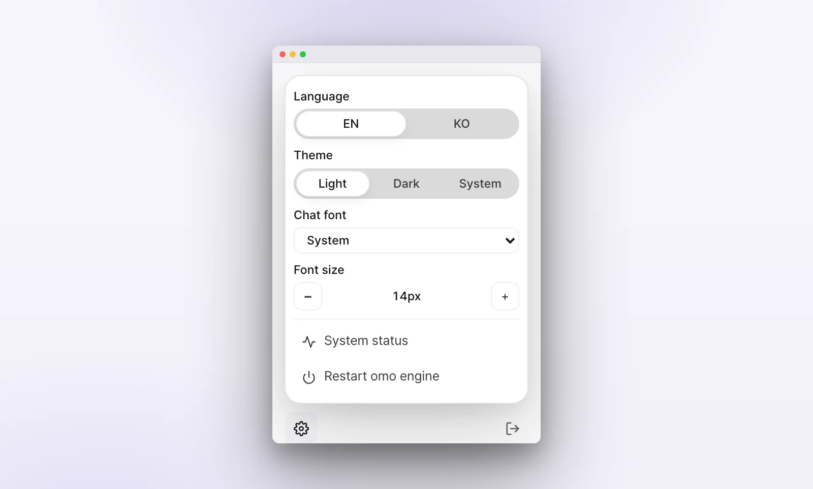
  </picture>
  <br /><b>설정 · Settings</b><br /><sub>언어·테마·글꼴·글자 크기 · Language, theme, font and size</sub>
    </td>
  </tr>
</table>

<p align="center">
  <sub>GitHub 테마(다크/라이트)에 맞는 이미지가 표시됩니다. 화면 속 프로젝트와 대화는 데모용 예시입니다. · Images follow your GitHub theme; the projects and chats shown are demo examples.</sub>
</p>

---

## 한국어

### 바로 실행하기

설치 없이 명령 한 줄로 실행합니다. 둘 중 편한 쪽을 쓰세요.

```sh
bunx omo-webchat@latest --password <비밀번호> --port 8080 --root <작업 폴더>
```

```sh
npx omo-webchat@latest --password <비밀번호> --port 8080 --root <작업 폴더>
```

실행되면 브라우저에서 `http://127.0.0.1:8080`을 열고 `--password`로 정한 비밀번호로 로그인하세요.

필요한 것:

- `PATH`에 [omo](https://github.com/code-yeongyu/oh-my-openagent) CLI가 있어야 합니다. 실제 대답은 omo가 합니다.
- `bunx`는 Bun, `npx`는 Node 18 이상이 필요합니다.

### 파라미터 설명

| 파라미터 | 무엇인가요 | 기본값 | 언제 바꾸나요 |
|---|---|---|---|
| `--password` | 웹 화면에 들어갈 때 입력하는 비밀번호입니다. | 없음 (**필수**) | 항상 직접 정하세요. 서버를 다시 켜면 다시 로그인해야 합니다. |
| `--port` | 브라우저 주소 `http://127.0.0.1:<포트>`의 숫자입니다. | `8080` | 다른 프로그램이 이미 8080을 쓰고 있을 때만 바꾸세요. |
| `--root` | 파일 브라우저와 워크스페이스에서 보이는 가장 바깥 폴더입니다. 이 폴더 바깥은 웹에서 보이지 않습니다. | 홈 폴더 | 평소 작업하는 폴더(예: 프로젝트들이 모여 있는 폴더)로 좁히는 것을 권장합니다. |
| `--host` | 서버가 어느 주소에서 접속을 받을지 정합니다. 기본값은 이 컴퓨터에서만 접속할 수 있습니다. | `127.0.0.1` | 보통은 그대로 두세요. 다른 기기에서 접속하려면 이 값을 바꾸지 말고 [외부에서 접속하기](#외부에서-접속하기)를 따르세요. |
| `--state-dir` | 워크스페이스·채팅 목록 같은 앱 상태를 저장하는 폴더입니다. | `$XDG_STATE_HOME/omo-webchat` 또는 `~/.local/state/omo-webchat` | 거의 바꿀 일이 없습니다. 상태를 따로 분리하고 싶을 때만 쓰세요. |

- 모든 파라미터는 환경 변수로도 줄 수 있습니다(`TH_PASSWORD`, `TH_PORT`, `TH_ROOT`, `TH_HOST`, `TH_STATE_DIR`). 둘 다 있으면 명령줄 파라미터가 우선합니다.
- `PATH`에 다른 `omo`가 있거나 특정 빌드를 쓰고 싶다면 `CHAT_PI_BINARY`에 omo 실행 파일의 절대 경로를 지정하세요. 이 값이 항상 가장 먼저 쓰입니다.

### 외부에서 접속하기

휴대폰이나 다른 컴퓨터에서 쓰고 싶다면 서버는 위 명령 그대로 켜 두고, 아래 도구 중 하나로 HTTPS 주소를 만드세요. `--host`는 바꿀 필요가 없습니다.

#### 방법 1. Tailscale (권장)

내 기기끼리만 연결되는 사설망입니다. 나만 쓴다면 이 방법이 가장 안전하고 간단합니다.

1. 서버 컴퓨터와 접속할 기기(휴대폰 등)에 [Tailscale](https://tailscale.com/download)을 설치하고 같은 계정으로 로그인합니다.
2. 서버 컴퓨터에서 실행합니다.

   ```sh
   tailscale serve --bg 8080
   ```

3. 출력된 `https://<기기 이름>.<tailnet 이름>.ts.net` 주소를 접속할 기기의 브라우저에서 엽니다.

- 처음 실행하면 tailnet에서 HTTPS를 켜라는 안내가 나올 수 있습니다. 안내된 링크에서 허용하면 됩니다.
- 공유를 끄려면 `tailscale serve reset`을 실행하세요.
- `tailscale funnel`은 인터넷 전체에 공개하는 기능이니 쓰지 마세요.
- 자세한 내용: [Tailscale Serve 문서](https://tailscale.com/docs/features/tailscale-serve)

#### 방법 2. Cloudflare Tunnel

Tailscale을 설치할 수 없는 기기에서 접속해야 할 때 씁니다. **주소를 아는 누구나 로그인 화면까지 들어올 수 있습니다.**

1. [cloudflared](https://developers.cloudflare.com/cloudflare-one/networks/connectors/cloudflare-tunnel/downloads/)를 설치합니다.
2. 서버 컴퓨터에서 실행합니다.

   ```sh
   cloudflared tunnel --url http://127.0.0.1:8080
   ```

3. 출력된 `https://<임의의 이름>.trycloudflare.com` 주소로 접속합니다. 이 주소는 실행할 때마다 바뀌고, 명령을 끄면 사라집니다.

- 잠깐 쓰는 용도로만 쓰세요. 계속 쓰려면 이름 있는 터널에 [Cloudflare Access](https://developers.cloudflare.com/cloudflare-one/access-controls/applications/http-apps/self-hosted-public-app/)로 이메일 인증 등을 앞에 두는 것을 권장합니다.
- 자세한 내용: [Quick Tunnels 문서](https://developers.cloudflare.com/cloudflare-one/networks/connectors/cloudflare-tunnel/do-more-with-tunnels/trycloudflare/)

#### 외부에 열 때 주의할 점

- **비밀번호를 길고 추측하기 어렵게 정하세요.** 로그인하면 파일을 편집할 수 있고 omo가 이 컴퓨터에서 명령을 실행할 수 있습니다.
- **터널을 쓰면 로그인 차단이 모든 사람에게 함께 걸립니다.** 서버는 한 IP에서 1시간 안에 비밀번호를 10번 틀리면 그 IP를 1시간 동안 막습니다. 그런데 터널을 거친 접속은 모두 같은 IP(`127.0.0.1`)로 보이기 때문에, 누군가 10번 틀리면 본인도 1시간 동안 로그인할 수 없습니다. 공개 주소를 오래 열어 둘 때 Cloudflare Access를 권하는 이유입니다.

### 주요 기능

`omo-webchat`은 Go 바이너리 하나로 동작하는 로컬 웹 채팅 UI입니다. 임베드된 React SPA를 서빙하고, 모든 채팅을 공유 omo 프로세스(`omo --mode rpc --multi-session`) 위의 논리 세션으로 실행합니다.

- 비밀번호 로그인 뒤의 채팅 SPA, WebSocket 스트리밍, GFM 마크다운
- 워크스페이스별 채팅 관리, 파일 브라우저(업로드·편집·다운로드), `@` 파일 멘션
- `/` 슬래시 명령, `$` 스킬 팔레트, 모델 선택, 이미지 첨부
- 가로/세로 분할 뷰, 한국어/English, 폰트·글자 크기 설정, 모바일 대응

### omo와 senpi 함께 업데이트하기

채팅에서 `/update`를 선택하거나 입력한 뒤 전송하고 **함께 업데이트**를 누르세요.
서버가 현재 사용하는 omo 설치의 패키지 매니저로 `omo-ai@beta`와 그 버전에
고정된 senpi 엔진을 함께 설치합니다. 별도로 설치된 전역 senpi나 omo-webchat
자체를 업데이트하는 기능은 아닙니다. 제공자가 자체 `/update` 명령을 등록했다면
그 명령이 우선합니다.

로그인한 사용자만 실행할 수 있고, 동시에 들어온 업데이트 요청은 거부합니다.
설치 실패는 대화상자에 표시하며 자동으로 재시도하지 않습니다. 창을 닫아도
설치는 계속되고, 같은 채팅에서 `/update`를 다시 보내면 결과를 확인할 수 있습니다.
인식할 수 없는 사용자 정의 설치는 다른 설치를 대신 갱신하지 않고 오류를 반환합니다.

macOS·Linux의 npm 전역 prefix와 Bun 전역 설치를 지원합니다. Windows는 실행 중인
네이티브 모듈의 파일 잠금으로 설치가 손상될 수 있어 웹 업데이트를 거부합니다.
Windows에서는 모든 omo/senpi 프로세스와 웹챗을 종료한 뒤 터미널에서 설치에 사용한
패키지 매니저로 업데이트하세요.

설치 완료가 실행 중인 엔진의 교체를 뜻하지는 않습니다. 설치가 끝나면 같은
대화상자의 **지금 적용**을 누르세요. 웹챗을 떠나지 않고 엔진만 새 프로세스로
교체해 새 버전을 활성화합니다. 나중에 적용하려면 설정 메뉴의 **omo 엔진 다시
시작**을 눌러도 같은 동작이 실행됩니다. 기존 세션을 강제로 재시작하지 않습니다.

### omo 엔진 다시 시작하기

설정 메뉴의 **omo 엔진 다시 시작**을 누르면 서버가 실행 중인 omo 엔진
프로세스만 새 프로세스로 교체합니다. omo-webchat 자체는 웹 UI에서 재시작되지
않고 로그인 상태도 유지됩니다.

열린 채팅은 새 엔진 연결에서 자동으로 다시 열리지만, 교체 순간 스트리밍 중이던
답변은 중단됩니다. 실행 중인 채팅이 있으면 확인 창이 미리 경고합니다.
로그인한 사용자만 실행할 수 있고, 설치 업데이트와 엔진 재시작은 동시에
실행되지 않습니다. 한쪽이 진행 중이면 다른 요청은 거부합니다.

이 서버가 시작한 엔진만 재시작할 수 있습니다. 다른 프로세스가 시작한 엔진에
연결된 경우에는 소유하지 않은 프로세스를 안전하게 종료할 방법이 없어 요청을
거부합니다. 업데이트 없이도, 엔진을 오래 켜 둔 뒤 새로 시작하고 싶을 때
단독으로 사용할 수 있습니다.

### 보안

기본 바인드는 루프백(`127.0.0.1`)이고 프로세스 안에 TLS는 없습니다. 비루프백에 바인드할 때는 TLS 역프록시 뒤에 두세요. 세션 토큰은 메모리에만 있어 재시작하면 다시 로그인합니다.

### 기타 설치 방법

위의 `bunx`/`npx` 실행을 권장합니다. 바이너리를 직접 설치하거나 소스에서 빌드하려면 아래를 참고하세요.

#### 지원 환경과 세부 요구 사항

- macOS·Linux (amd64/arm64), Windows (amd64/arm64, zip 릴리스).
- Windows RPC는 인증된 named pipe를 사용합니다. CI 런타임은 `omo-ai@5.0.0-0.beta.43` (senpi `2026.9.5`), Bun `1.3.10`, Node `24.15.0`으로 고정되어 있습니다. Bun의 `omo.exe` 또는 npm이 생성한 `omo.cmd`를 PATH에 두세요. npm 설치는 Node로 실제 `omo.js`를 실행하며, `CHAT_PI_BINARY`에 해당 `.js`의 절대 경로를 직접 지정할 수도 있습니다. 서버는 필요한 데몬을 시작하거나 호환 데몬을 재사용하며, 자신이 시작한 프로세스 트리만 종료합니다. 잘못된 크기·소유권·권한의 `.secret` 파일이나 reparse 경로는 자동 덮어쓰기 없이 거부합니다.
- 테스트한 호스티드 Windows 환경(Bun 1.4.2)에서 `bunx --bun`은 설치 후 래퍼를 실행하지 않고 종료되는 것이 관찰됐습니다. 해당 환경에서는 `npx` 또는 일반 `bunx`를 쓰세요.

#### npm 패키지 구성과 배포 태그

npm 패키지는 래퍼(`omo-webchat`) 하나와 여섯 개의 플랫폼 바이너리 패키지(`omo-webchat-<os>-<arch>`)로 구성됩니다. `optionalDependencies`가 현재 플랫폼에 맞는 하나만 같은 버전으로 설치합니다.

안정 버전은 `latest` 태그, 프리릴리스(예: `0.1.0-rc.1`)는 `next` 태그로 배포됩니다. 게시 여부는 시점에 따라 달라지니 설치하려는 버전이 공개되어 있는지 npm 패키지 페이지와 GitHub Releases에서 확인하세요. 릴리스 파이프라인과 게시 절차는 [docs/releasing.md](docs/releasing.md)를 참고하세요.

#### 설치 스크립트 (macOS · Linux)

```sh
curl -fsSL https://raw.githubusercontent.com/DevNewbie1826/omo-webchat/main/install.sh | sh
```

특정 버전·경로를 지정하려면:

```sh
curl -fsSL https://raw.githubusercontent.com/DevNewbie1826/omo-webchat/main/install.sh | VERSION=vX.Y.Z INSTALL_DIR=~/.local/bin sh
```

#### 설치 스크립트 (Windows)

PowerShell 5.1 이상에서 실행하세요. 관리자 권한은 필요 없습니다.

```powershell
irm https://raw.githubusercontent.com/DevNewbie1826/omo-webchat/main/install.ps1 | iex
```

릴리스 zip(`omo-webchat_windows_amd64.zip`)을 내려받아 `checksums.txt`의 SHA-256과 대조한 뒤 `%LOCALAPPDATA%\Programs\omo-webchat`에 설치하고, 그 경로를 사용자 PATH에 추가합니다(새 터미널부터 적용).

특정 버전·경로를 지정하거나 PATH를 건드리지 않으려면 인자를 넘기세요:

```powershell
& ([scriptblock]::Create((irm https://raw.githubusercontent.com/DevNewbie1826/omo-webchat/main/install.ps1))) -Version vX.Y.Z -InstallDir C:\tools\omo-webchat -NoPathUpdate
```

Windows x64·arm64를 모두 지원하며, 호스트 아키텍처에 맞는 자산을 자동으로 받습니다.

#### 설치 후 실행

```sh
omo-webchat --password <비밀번호> --port 8080 --root <작업 폴더>
```

파라미터는 [파라미터 설명](#파라미터-설명)과 같습니다. 백그라운드 실행(darwin/linux):

```sh
omo-webchat --password <비밀번호> --daemon   # 시작
omo-webchat --status                         # 상태
omo-webchat --stop                           # 중지
```

#### 소스 빌드

```sh
make build   # 프론트엔드(npm ci + vite build) 후 go build → bin/omo-webchat
```

Go 1.26, Node 22가 필요합니다. 로컬 실행은 `make run` (개발용 비밀번호 `dev123`).

#### 테스트

```sh
go test ./...
cd frontend && npx vitest run
sh test/install_checksum_test.sh
pwsh -NoProfile -File test/install_ps1_test.ps1   # Windows installer
```

---

## English

### Quick start

Run it with one command, no install needed. Use whichever you prefer.

```sh
bunx omo-webchat@latest --password <password> --port 8080 --root <work folder>
```

```sh
npx omo-webchat@latest --password <password> --port 8080 --root <work folder>
```

Then open `http://127.0.0.1:8080` in your browser and log in with the password you passed to `--password`.

You need:

- The [omo](https://github.com/code-yeongyu/oh-my-openagent) CLI on your `PATH`. omo is what actually answers the chats.
- Bun for `bunx`, or Node 18+ for `npx`.

### Parameters

| Parameter | What it is | Default | When to change it |
|---|---|---|---|
| `--password` | The password you type to enter the web UI. | none (**required**) | Always set your own. Restarting the server requires logging in again. |
| `--port` | The number in the browser address `http://127.0.0.1:<port>`. | `8080` | Only when another program already uses 8080. |
| `--root` | The outermost folder visible in the file browser and workspaces. Nothing outside it is visible from the web. | home directory | Recommended: narrow it to the folder you work in (for example, the folder holding your projects). |
| `--host` | Which address the server accepts connections on. The default allows connections from this computer only. | `127.0.0.1` | Usually leave it. To reach it from other devices, keep this value and follow [Access from other devices](#access-from-other-devices) instead. |
| `--state-dir` | Where app state such as workspaces and chat lists is stored. | `$XDG_STATE_HOME/omo-webchat` or `~/.local/state/omo-webchat` | Rarely. Only when you want to keep state separate. |

- Every parameter can also come from an environment variable (`TH_PASSWORD`, `TH_PORT`, `TH_ROOT`, `TH_HOST`, `TH_STATE_DIR`). When both are set, the command-line parameter wins.
- If a different `omo` is on your `PATH`, or you want a specific build, set `CHAT_PI_BINARY` to the absolute path of the omo executable. That variable always wins.

### Access from other devices

To use it from your phone or another computer, keep the server running with the command above and create an HTTPS address with one of these tools. You do not need to change `--host`.

#### Option 1. Tailscale (recommended)

A private network that connects only your own devices. If you are the only user, this is the safest and simplest option.

1. Install [Tailscale](https://tailscale.com/download) on the server computer and on the device you will connect from (for example, your phone), and sign in with the same account.
2. On the server computer, run:

   ```sh
   tailscale serve --bg 8080
   ```

3. Open the printed `https://<machine-name>.<tailnet-name>.ts.net` address in the browser on your other device.

- The first run may ask you to enable HTTPS for your tailnet; allow it from the link it prints.
- To stop sharing, run `tailscale serve reset`.
- Do not use `tailscale funnel`: it publishes the server to the whole internet.
- More: [Tailscale Serve docs](https://tailscale.com/docs/features/tailscale-serve)

#### Option 2. Cloudflare Tunnel

Use this when the device you connect from cannot run Tailscale. **Anyone who knows the address can reach the login page.**

1. Install [cloudflared](https://developers.cloudflare.com/cloudflare-one/networks/connectors/cloudflare-tunnel/downloads/).
2. On the server computer, run:

   ```sh
   cloudflared tunnel --url http://127.0.0.1:8080
   ```

3. Open the printed `https://<random-name>.trycloudflare.com` address. It changes on every run and disappears when you stop the command.

- Use it only for short sessions. For regular use, put [Cloudflare Access](https://developers.cloudflare.com/cloudflare-one/access-controls/applications/http-apps/self-hosted-public-app/) (for example, email verification) in front of a named tunnel.
- More: [Quick Tunnels docs](https://developers.cloudflare.com/cloudflare-one/networks/connectors/cloudflare-tunnel/do-more-with-tunnels/trycloudflare/)

#### Before you expose it

- **Use a long, hard-to-guess password.** Once logged in, someone can edit files and omo can run commands on this computer.
- **Behind a tunnel, a login ban locks out everyone.** The server bans an IP for one hour after 10 wrong passwords within an hour. Every request through a tunnel arrives from the same IP (`127.0.0.1`), so if someone else fails 10 times, you are locked out for an hour too. That is why Cloudflare Access is recommended when a public address stays open.

### Features

`omo-webchat` is a single Go binary that serves an embedded React SPA and runs every chat as a logical session on one shared omo process (`omo --mode rpc --multi-session`).

- Password-gated chat SPA, WebSocket streaming, GFM markdown
- Workspaces, file browser (upload / edit / download), `@` file mentions
- `/` slash commands, `$` skill palette, model picker, image attachments
- Horizontal/vertical split panes, Korean/English UI, font settings, mobile support

### Update omo and senpi together

Select or type `/update`, submit it, then choose **Update both**. The server
updates its configured omo installation to `omo-ai@beta` using that installation's
package manager, including the matching pinned senpi engine. It does not update
a separately installed global senpi or omo-webchat itself. A provider-advertised
`/update` command retains precedence.

The action requires login and rejects concurrent update requests. Installation
failures remain visible without automatic retries. Closing the dialog does not
cancel installation; submit `/update` again in the same chat to see its result.
Unrecognized custom installations fail instead of updating a different installation.

Global npm-prefix and Bun installations are supported on macOS and Linux.
Windows in-place updates are rejected because loaded native-module locks can
leave a partial installation. On Windows, stop every omo/senpi process and
webchat first, then update with the installation's package manager in a terminal.

Installation does not replace the running engine. When the install finishes,
choose **Apply now** in the same dialog: it replaces just the engine process with
a fresh one and activates the new version without leaving omo-webchat. To apply
it later instead, **Restart omo engine** in the settings menu does the same
thing. Existing sessions are never forcibly restarted by this action.

### Restart the omo engine

Choose **Restart omo engine** in the settings menu, and the server replaces only
the running omo engine process with a fresh one. omo-webchat itself is never
restarted from the web UI, and you stay signed in.

Open chats reopen automatically on the new engine connection, but an answer that
is streaming at that moment is interrupted. The confirmation dialog warns when
chats are running. The action requires login, and installation updates and engine
restarts never run at the same time; a second request while one runs is refused.

Only an engine started by this server can be restarted. When the server attached
to an engine someone else started, the request is refused because there is no safe
way to stop a process this server does not own. A restart is also useful on its
own, without an update, when the engine has been running for a long time.

### Security

Binds to loopback (`127.0.0.1`) by default and has no in-process TLS — put a TLS reverse proxy in front when binding off loopback. Session tokens are memory-only, so a restart requires a new login.

### Other install options

Running with `bunx`/`npx` above is recommended. To install the binary directly or build from source, see below.

#### Platforms and detailed requirements

- macOS / Linux (amd64, arm64), Windows (amd64, arm64, zip release).
- Windows RPC uses authenticated named pipes. CI pins `omo-ai@5.0.0-0.beta.43` (senpi `2026.9.5`), Bun `1.3.10`, and Node `24.15.0`. Put Bun's `omo.exe` or npm's `omo.cmd` on PATH. npm installs run the actual `omo.js` through Node; `CHAT_PI_BINARY` can also name the absolute `.js` entry path. The server starts a missing daemon or reuses a compatible one, and only terminates process trees it owns. Malformed, untrusted, or reparse-backed `.secret` files are rejected rather than overwritten; valid secrets are retained across shutdown and re-read on reconnect.
- On the tested hosted Windows setup with Bun 1.4.2, `bunx --bun` was observed to exit after installation without running the wrapper; use `npx` or plain `bunx` there.

#### npm packages and release tags

The npm distribution is one wrapper package (`omo-webchat`) plus six platform binary packages (`omo-webchat-<os>-<arch>`). `optionalDependencies` installs exactly the one matching your platform, at the same version as the wrapper.

Stable versions publish under the `latest` tag; prereleases (for example `0.1.0-rc.1`) publish under `next`. Publication state changes over time, so check the npm package page and GitHub Releases to confirm the version you want is public. See [docs/releasing.md](docs/releasing.md) for the release pipeline and publication procedure.

#### Install script (macOS / Linux)

```sh
curl -fsSL https://raw.githubusercontent.com/DevNewbie1826/omo-webchat/main/install.sh | sh
```

Pin a version or install path:

```sh
curl -fsSL https://raw.githubusercontent.com/DevNewbie1826/omo-webchat/main/install.sh | VERSION=vX.Y.Z INSTALL_DIR=~/.local/bin sh
```

#### Install script (Windows)

Run in PowerShell 5.1 or newer; no administrator rights required.

```powershell
irm https://raw.githubusercontent.com/DevNewbie1826/omo-webchat/main/install.ps1 | iex
```

It downloads the release zip (`omo-webchat_windows_amd64.zip`), verifies its SHA-256 against `checksums.txt`, installs into `%LOCALAPPDATA%\Programs\omo-webchat`, and adds that directory to your user PATH (effective in new terminals).

Pass arguments to pin a version, choose a directory, or leave PATH alone:

```powershell
& ([scriptblock]::Create((irm https://raw.githubusercontent.com/DevNewbie1826/omo-webchat/main/install.ps1))) -Version vX.Y.Z -InstallDir C:\tools\omo-webchat -NoPathUpdate
```

Both Windows x64 and arm64 are supported; the matching asset is picked from your host architecture.

#### Run after installing

```sh
omo-webchat --password <password> --port 8080 --root <work folder>
```

Parameters are the same as in [Parameters](#parameters). Background daemon (darwin/linux):

```sh
omo-webchat --password <password> --daemon   # start
omo-webchat --status                         # status
omo-webchat --stop                           # stop
```

#### Build from source

```sh
make build   # frontend (npm ci + vite build), then go build → bin/omo-webchat
```

Requires Go 1.26 and Node 22. For local runs: `make run` (dev password `dev123`).

#### Tests

```sh
go test ./...
cd frontend && npx vitest run
sh test/install_checksum_test.sh
pwsh -NoProfile -File test/install_ps1_test.ps1   # Windows installer
```
